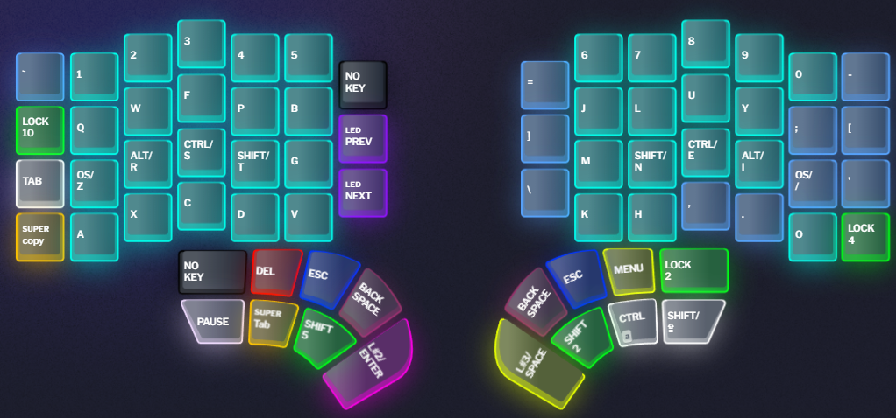
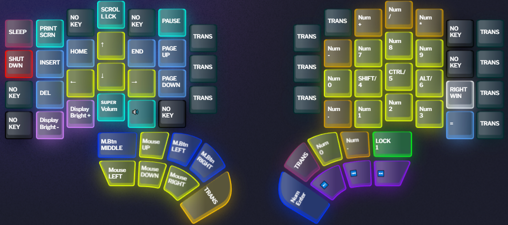
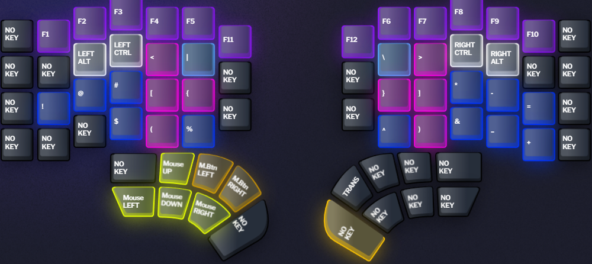
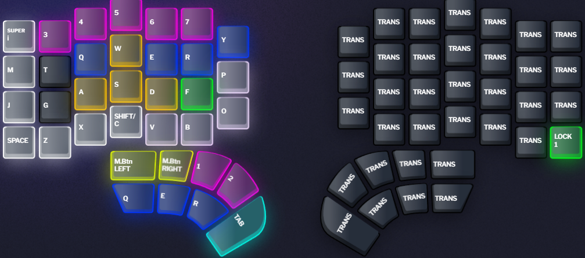
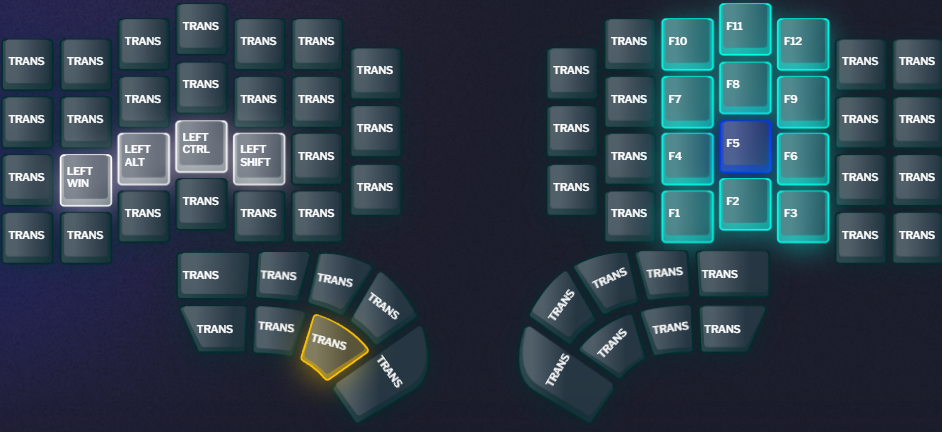
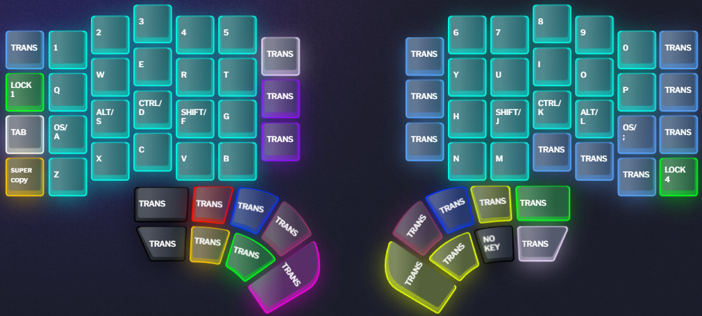

# My Dygma Defy layers

This repo explains my approach to using layers in my Dygma Defy keyboard.

---

## Table of contents

- [My Dygma Defy layers](#my-dygma-defy-layers)
  - [Table of contents](#table-of-contents)
  - [ Super keys](#-super-keys)
  - [ Macros](#-macros)
  - [ Layers](#layer_1imgiconlayerssmsvg-layers)
    - [Layer 1: Base](#layer-1-base)
    - [Layer 2: Navigation, Numbers and Media](#layer-2-navigation-numbers-and-media)
    - [Layer 3: Symbols and F-keys](#layer-3-symbols-and-f-keys)
    - [Layer 4: Gaming](#layer-4-gaming)
    - [Layer 5: F-keys](#layer-5-f-keys)
    - [Layer 6: Mouse](#layer-6-mouse)
    - [Layer 10: Qwerty](#layer-10-qwerty)
  - [ Preferences](#-preferences)

---

##  Color scheme

I use the following color scheme to indicate different types of keys:

- `rgb(0, 254, 24)`: ${\textsf{\color{rgb(0, 254, 24)}Layers}}$
- `rgb(255, 196, 0)`: ${\textsf{\color{rgb(255, 196, 0)}Super keys}}$
- `rgb(255, 255, 255)`: ${\textsf{\color{rgb(255, 255, 255)}Modifiers}}$
- `rgb(0, 254, 234)`: ${\textsf{\color{rgb(0, 254, 234)}Standard keys}}$
- `rgb(0, 52, 255)`: ${\textsf{\color{rgb(0, 52, 255)}Escape}}$
- `rgb(87, 164, 255)`: ${\textsf{\color{rgb(87, 164, 255)}Symbols}}$
- `rgb(255, 9, 0)`: ${\textsf{\color{rgb(255, 9, 0)}Delete/Shutdown}}$
- `rgb(152, 51, 107)`: ${\textsf{\color{rgb(152, 51, 107)}Backspace/Sleep}}$

---

##  Super keys

| Name            | Tap                      | Hold                                     | Double tap                      | Tap + Hold                                        |
|:----------------|:-------------------------|:-----------------------------------------|:--------------------------------|:--------------------------------------------------|
| **Tab**         | <kbd>Tab</kbd>           | <kbd>Shift</kbd> + <kbd>Tab</kbd>        | <kbd>Alt</kbd> + <kbd>Tab</kbd> | 
| **Copy**        | <kbd>Ctrl</kbd> + <kbd>C | <kbd>Ctrl</kbd> + <kbd>V</kbd>           | <kbd>Ctrl</kbd> + <kbd>X</kbd>  | <kbd>Ctrl</kbd> + <kbd>Shift</kbd> + <kbd>V</kbd> |
| **Gaming i**    | <kbd>I</kbd> (inventory) | <kbd>Ctrl</kbd> + <kbd>I</kbd> (invoke ) |
| **Volume down** | Volume down              | Mute                                     |

---

##  Macros

##  Layers

### Layer 1: Base

- Base layer
  - Colemak DH matrix layout with some modifications
    - For more information on Colemak DH refer to [this page](https://colemakmods.github.io/mod-dh/)
    - As my pinkies are not long enough to reach the home row comfortably, I swapped 
      - A and Z
      - O and /
  - Utilizes home row modifiers (GACS order)
    - For more information on home row mods refer to [this page](https://precondition.github.io/home-row-mods)
  
- Left side
  - Capslock is replaced with escape for easier access
  - Escape is replaced with my shortcut to accept code completion in my IDEs
  - Enter in the bottom left corner helps with one handed use
  - Most of my layer changing is on the left hand thumb cluster
    - Shift 2 -> Symbols
    - Lock 3 -> Navigation
    - Lock 5 -> Modifier + F-keys layer
    - Shift 6 -> IDE shortcuts
  - Inner column utilized for undo, copy, cut, paste
  - Pause is used as compose key, I don't like dead keys, so I use WinCompose 
- Right side
  - Backspace replaced with windows snipping tool shortcut
  - Couple of layer changing buttons
    - Shift 6 -> IDE shortcuts
    - Lock 7 -> Gaming layer
    - Lock 8 -> Numpad

- Super k

---

### Layer 2: Navigation, Numbers and Media

- Symbols layer with F-keys
  - Contains all symbols available in the finnish keymap
    - The point is to never have to use top row numbers for symbols

- Left side
  - Tab replaced with Alt+F4
  - Capslock is there if it is ever needed
- Right side
  - Backspace and delete have ctrl added as a modifier for easier whole word deletion

---

### Layer 3: Symbols and F-keys

- I wanted to have open and close brackets and parentheses on mirrored keys
  - Open bracket is on the left side
  - Close bracket is on the right side
- Other symbols from the number row are on put on the home row
  - This is to avoid having to use the number row for symbols

---

### Layer 4: Gaming

- Left hand
  - WASD on center keys, as they feel more natural to use
  -

---

### Layer 5: F-keys

- Left hand
  - WASD on center keys, as they feel more natural to use
- Right hand
  - Key to switch to back to base layer. This is useful when I need to type something in the middle of gaming.

---

### Layer 6: Mouse

- Mouse layer
  - Right hand moves cursor
  - Right thumb does clicks to make dragging motions easy
  - Left hand scrolls
---

### Layer 10: Qwerty

- Qwerty layer
  - For when I need to be quick, while still learning Colemak DH

##  Preferences

